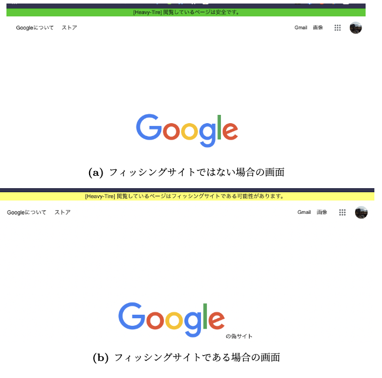

  [](LICENSE)

# 「Heavy-Tire」 - フィッシングサイト判定システム

<div align="center">
  <a href="https://xryuseix.github.io/slides/?slide=%E3%83%95%E3%82%A3%E3%83%83%E3%82%B7%E3%83%B3%E3%82%B0%E3%82%B5%E3%82%A4%E3%83%88%E5%88%A4%E5%AE%9A%E3%82%B7%E3%82%B9%E3%83%86%E3%83%A0%20Heavy-Tire">
    
    <br />
    (画像をクリックで説明スライドへ飛びます)
  </a>
</div>

## フィッシング判定 Chrome拡張機能

<div align="center">
  
</div>

## フィッシング判定 API

フィッシングサイトかどうか判定します．

### Example

#### 正常サイトの場合

GET request:

```sh
https://heavy-tire.herokuapp.com/?url=twitter.com
```

Return:

```js
{"result":0}
```

#### フィッシングサイトの場合

GET request:

```sh
https://heavy-tire.herokuapp.com/?url=utchweb.gtphost.com/zimbra/exch/owa/uleth/index.html
```

Return:

```js
{"result":1}
```

## 環境について


[Pipfile](./Pipfile) + [requirements.txt](WebAPI/requirements.txt) の環境設定ファイルは x86_64(intel) 環境の場合に用います．


[requirements.yaml](WebAPI/requirements.yaml) の環境設定ファイルは aarch64(ARM) 環境の場合に用います．
こちらの環境の場合，sklearn や pandas などを使用するために conda, conda-forge 環境を用意する必要があります．
