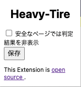

# 進捗報告用ページ

## 全体の進捗

|              内容              |        小課題 1        |      小課題 2       |
| :----------------------------: | :--------------------: | :-----------------: |
|        学習モデルの作成        |           ✅           |        なし         |
| フィッシング判定 WebAPI の作成 | FastAPI で作成<br />✅ | Rust で作成<br />❌ |
|       chrome 拡張の作成        |           ❌           |        なし         |

## 各週の報告

### 第 1 週 (4/7)

- ガイダンス
- テーマの案をいくつか出した

### 第 2 週 (4/14)

- 今日までにフィッシングサイトの学習モデルを作成し，予測可能な状態にするつもりでした．
- 学習は完了しました．結果はこのような感じになりました．

```txt
Training Accuracy : 0.970163273132383
Testing Accuracy : 0.9594209863328892

CLASSIFICATION REPORT

              precision    recall  f1-score   support

         Bad       0.97      0.89      0.93     38937
        Good       0.96      0.99      0.97     98400

    accuracy                           0.96    137337
   macro avg       0.96      0.94      0.95    137337
weighted avg       0.96      0.96      0.96    137337
```

- 予測は終わりませんでした．原因としては Python のエラーがうまくとれなかった事にあります．以下のような python のコードで assertion error がでます．型アノテーションの仕様で時間を使ってしまいました．

```py
def wordStr2IntVec(url: str):
    assert(type(url) == type(""))
```

- 次回までにこれを終わらせ，FastAPI でサーバを立てるまで行います．

### 第 3 週 (4/21)

#### 今日の予定

FastAPI で WebAPI サーバを立てる

#### やったこと

Python の環境構築, Rust-Python ラッパーのテストを行った．

#### できなかったことと理由

昨日 M1 Mac の brew,pyenv,Python を全部 intelx86 版から M1 Mac 版に変えたら Python がうまく動かなくなりました．

- Python3.6.4...pip が動きません,ビルドも正規の手法でできません
- Python3.7...pandas が動きません,ビルドも正規の手法でできません
- Python3.8...pandas,sklearn が動きません,ビルドも正規の手法でできません
- Python3.9...pandas,sklearn が動きません

結果 3.6.4 で pip のパッケージを github から直接 clone してビルドしました．ですが，WebAPI は立ちません(HTTP 系のパッケージでエラーが出てそうです)．
そこで，FastAPI は使わずに，当初から予定していた Rust(actix-web) でサーバを立てます．ただ，学習モデルの読み込みはそのままでは Rust で読み込めないので，Rust-Python ラッパーを使用します．を実行したら

```txt
❯ cargo run
   Compiling WebAPI-Rust v0.1.0 (/WebAPI-Rust)
    Finished dev [unoptimized + debuginfo] target(s) in 0.43s
     Running `target/debug/WebAPI-Rust`
hello, from Python
```

とうまく動きました．

#### 次回の目標

Rust(actix-web)で API サーバを立てる

### 第 4 週 (4/28)

#### 今日の予定

Rust(actix-web)で API サーバを立てる

#### やったこと

FastAPI で API サーバを立てた
PyO3 と actix-web という Rust のクレートを用いて，フィッシング判定 API を作成する予定でしたが，M1 Mac ではラッパー上で pandas が使えませんでした．また，HTTP 関連のライブラリが使えないのでローカルではサーバを立てられませんでした．そこで，heroku の本番環境上で API を開発しました．

```txt
https://heavy-tire.herokuapp.com/?url=URL
```

で使用できます．例としては

```txt
https://heavy-tire.herokuapp.com/?=twitter.com
```

です．結果が 0 の時は正常(good)サイト，1 の時は違法サイトです．

#### 次回の目標

chrome 拡張の雛形を作成する

### 第 5 週 (5/12)

#### 今日の予定

chrome 拡張の雛形を作成する

#### やったこと

chrome 拡張の雛形を作成しました．
機能としては， chrome 拡張のボタンを押すとポップアップで HTML が表示されて，その中にあるボタンを押すとページのタイトル，URL が出力されます．

#### 次回の目標

chrome 拡張からフィッシング検知 API の呼び出しを行いたい．

### 第 6 週 (5/19)

#### 今日の予定

chrome 拡張で Phising API を呼び出す

#### やったこと

chrome 拡張で Phising 判定 API を呼び出しました．今までの Phising 判定 API は CORS の`allow_origins`が`None`になっていたため，chrome 拡張内のスクリプトから呼び出すことができませんでした．よってこの設定を行い，chrome 拡張で Phising 判定 API を呼び出し，画面に表示するまで行いました．

#### 次回の目標

整形した状態でページ上部にフィッシング有無を表示させる．

### 第 7 週 (5/26)

#### 今日の予定

整形した状態でページ上部にフィッシング有無を表示させる．

#### やったこと

整形した状態でページ上部にフィッシング有無を表示させました．

- 安全なページの場合
  
- フィッシングサイトの場合
  

また，安全なページの場合は何も表示する必要がない上，いくつか設定項目を作れたらと思い，設定ページ(ポップアップ)を作りました．  


ただ，このポップアップページの情報をポップアップページの javascript から呼び出すと Content Security Policy に引っかかります．

```txt
Refused to execute inline event handler because it violates the following Content Security Policy directive: "script-src 'self' blob: filesystem: chrome-extension-resource:". Either the 'unsafe-inline' keyword, a hash ('sha256-...'), or a nonce ('nonce-...') is required to enable inline execution.
```

この場合，`onClick`や`onSubmit`などのイベントは使えないので，`document.addEventListener`を使用しました．この対応に少し時間を使ってしまいましたが，結果的に取得できました．

#### 次回の目標

今回までに作成した javascript は 2 つあります．

1. 閲覧している Web ページに何かコンテンツを挿入する javascript
2. ポップアップページの設定などを行う javascript

次回はこの二つの javascript 間でもメッセージ送信を行います(少し難しいので，厳しそうなら後回しにします)．

また，終わり次第学習モデルの修正へ移行したいと考えています．

### 第 8 週 (6/2)

#### 今日の予定

chrome 拡張の設定情報を以下の二つの javascript で読み書きできるようにします．

1. 閲覧している Web ページに何かコンテンツを挿入する javascript
2. ポップアップページの設定などを行う javascript

下記のデモに例えると，`1`は google.com に挿入するスクリプトを指し，`2`は右上の太文字で **Heavy-Tire** と書かれたページに挿入するスクリプトを指します．

#### やったこと

予定の通りです．


#### 次回の目標

フィッシング判定精度を向上させるため，学習モデルの修正します．

### 第 9 週 (6/9)

#### 今日の予定

前回一通りの機能を完成させ，[デモを公開](https://github.com/xryuseix/Heavy-Tire/blob/master/images/demo/settings.gif)しました．

今回は学習モデルの精度を向上させます．

#### やったこと

インターネット上では SVC を用いると精度 0.984 が出ると[報告](https://www.kaggle.com/tylersullivan/classifying-phishing-urls-three-models#Results)されています．

実際に SVC を実装し，評価をした結果がこちらになります．

```txt
=== CLASSIFICATION REPORT ===
model : LinearSVC-tfidf
Training Accuracy : 0.9981098694258893
Testing Accuracy : 0.9732805463765487

               precision    recall  f1-score   support

         Bad       0.97      0.91      0.94     28521
        Good       0.97      0.99      0.98     98278

    accuracy                           0.97    126799
   macro avg       0.97      0.95      0.96    126799
weighted avg       0.97      0.97      0.97    126799
```

テストデータの精度 0.973 と少し劣りましたが，今までの精度 0.964 より少し向上しました．

#### 次回の目標

URL の文字列に前後関係の意味が存在する可能性があると考え，RNN などテキスト分類モデルを試したいと思います．

### 第 10 週 (6/23)

### 第 11 週 (6/30)

### 第 12 週 (7/7)
